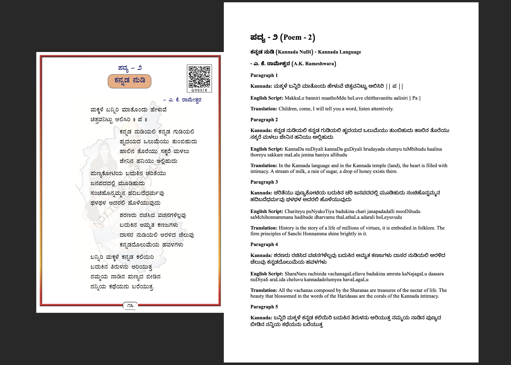

# Kannda Text Book Transliteration

This service processes PDF files by uploading them to Google Gemini, generating responses, and appending the responses to the original PDFs. Finally, it merges all the processed PDFs into a single final PDF.

## How It Works

1. **Upload and Process PDFs**: Uploads PDF files and generates responses.
2. **Append Responses**: Appends the generated responses to the original PDFs.
3. **Merge PDFs**: Merges all appended PDFs into a single final PDF.

## Setup 

1. Get API Key from https://ai.google.dev/gemini-api/docs/api-key

2. Create a .env file and update the API Token and Source PDF Directoy path.
```
cp .env.default .env
```
3. Install dependencies
```
pip install -r requirement.txt
```

## Data Preperation

1. Go to https://smallpdf.com/split-pdf#r=organize-split

2. Upload the PDF that you want to split, I uploaded Kannanda Textbook here

3. Select the checkbox to Split the PDF into multiple PDF’s with 1 page each, since Google's service can only handle small PDF.


4. Place the generated PDF in a directory and configure in .env as value of DIRECTORY_PATH variable.

## Running the Service

1. Place your original PDF files in the specified directory. Check .env.default, DIRECTORY_PATH

2. Run the `run.py` script:

```sh
python run.py
```

## Output Sample


